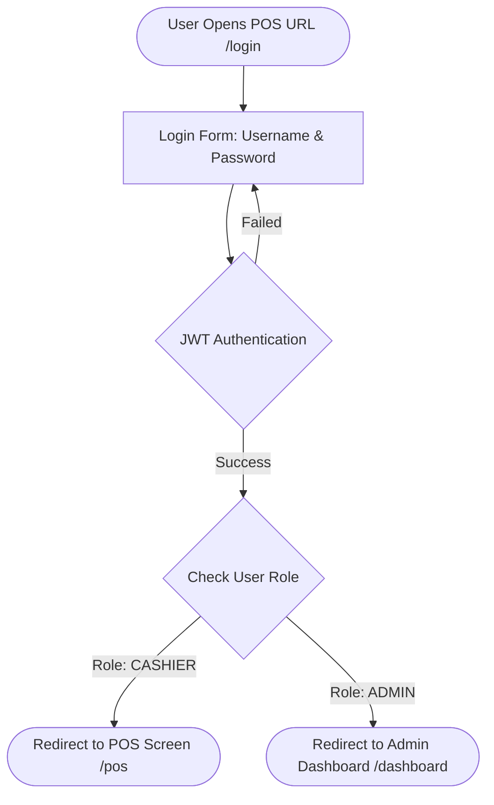
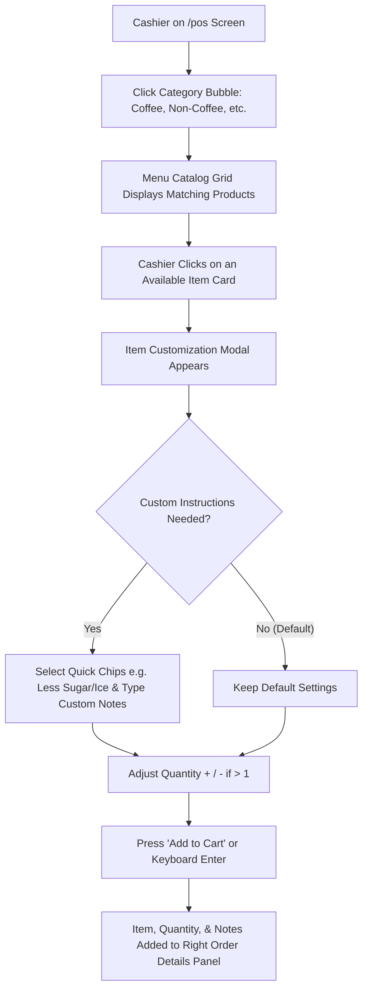
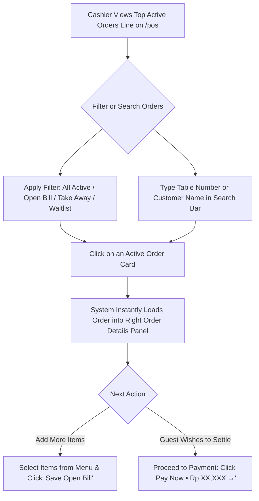
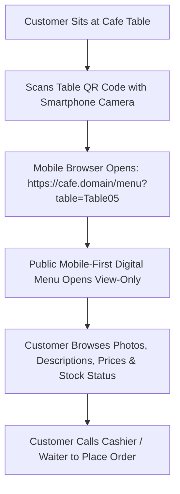

# 3. USER FLOWS & INTERACTION JOURNEYS (USER_FLOW.MD)

> **Main Specification Document:** Full 31-chapter technical specifications are maintained in [PRD_MASTER.md](file:///f:/Project/secondacc/docs/PRD_MASTER.md) and [1_PRD.md](file:///f:/Project/secondacc/docs/1_PRD.md).

---

## Flow 1: Login & Role-Based Access Control Routing



---

## Flow 2: Cashier Menu Selection & Customization Journey



---

## Flow 3: Active Orders Queue Interaction (Open Bill & Quick Load)



---

## Flow 4: Order History & 1-Tap Reprint Receipt (Slide-Over Drawer)

```mermaid
flowchart TD
    A[Customer Requests Receipt Reprint] --> B[Cashier Clicks Order History Icon on Slim Left Rail]
    B --> C[Slide-Over Drawer Slides In from the Right]
    C --> D[Search by Invoice # or Customer Name]
    D --> E[Click 'Reprint Receipt' on Matching Order]
    E --> F[Digital Receipt Preview Modal Opens]
    F --> G[System Triggers Browser Print Dialog: window.print()]
    G --> H[Cashier Closes Drawer & Returns to Register Instantly]
```

---

## Flow 5: Order Details & Atomic ACID Checkout Journey

```mermaid
flowchart TD
    A[Cashier on Right Order Details Panel] --> B{Select Order Type}
    B -- Dine In --> C[Enter Customer Name & Select Table from Dropdown / Leave Empty if Unseated]
    B -- Take Away --> D[Enter Customer Name without Table]
    C --> E[Select Customer Demographics: 👨 Male or 👩 Female]
    D --> E
    E --> F[Click Primary Action: 'Pay Now • Rp XX,XXX →']
    F --> G[Payment Modal Opens]
    G --> H{Select Payment Method}
    H -- Cash --> I[Enter Cash Tendered / Quick Cash Buttons 20k, 50k, 100k, Exact]
    I --> J[System Automatically Calculates Change Due]
    H -- Non-Cash --> K[Scan QRIS / Tap EDC Card Machine]
    J --> L[Click 'Complete Transaction']
    K --> L
    L --> M[Backend Executes Prisma $transaction ACID:]
    M --> N[1. Update Order Status = PAID]
    N --> O[2. Record Payment & Demographics Gender P/L]
    O --> P[3. Free Table if tableId exists: isOccupied = false]
    P --> Q[Display Receipt & Trigger window.print()]
    Q --> R[Transaction Moves to Completed History]
    R --> S([Order Details Resets, Ready for Next Customer])
```

---

## Flow 6: Self-Service Customer Menu Browsing (Table QR Code)


