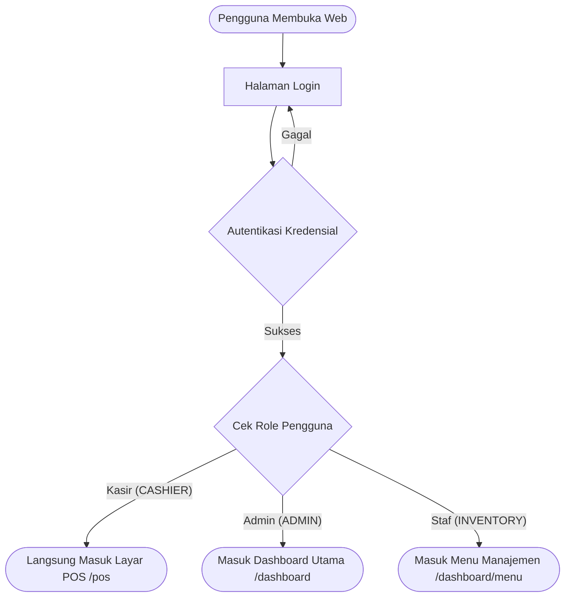
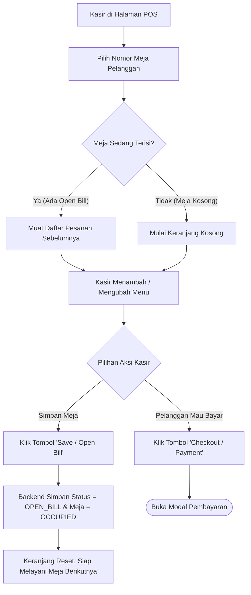
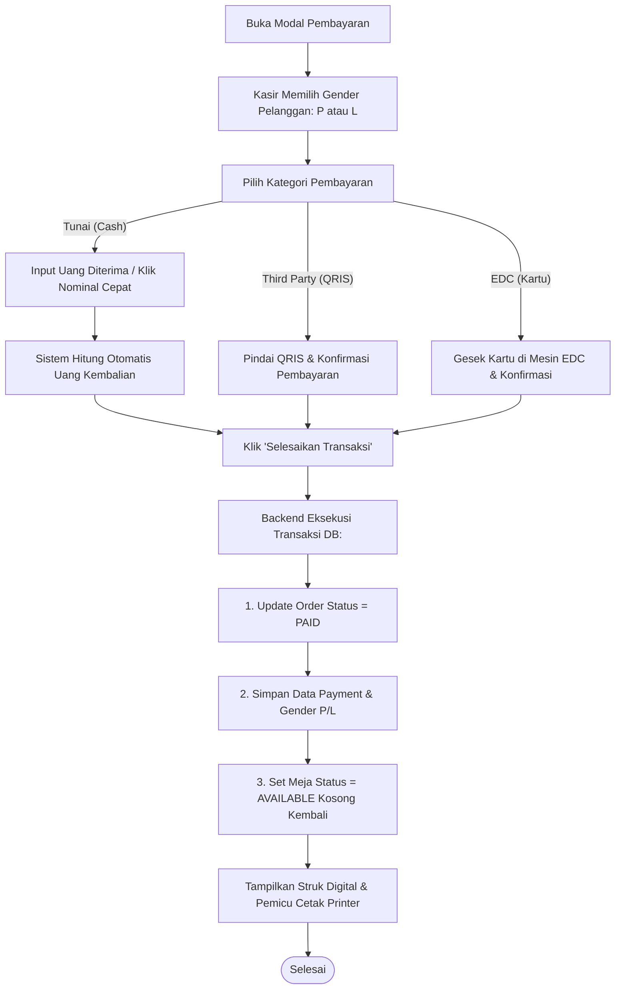
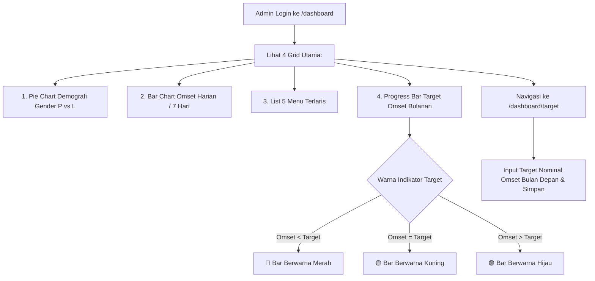

# 3. USER FLOWS & INTERACTION JOURNEYS (USER_FLOW.MD)

## Flow 1: Login & Navigasi Berdasarkan Peran (Role-Based Routing)

---

## Flow 2: Alur Kasir - Manajemen Meja & Open Bill

---

## Flow 3: Alur Pembayaran & Pencatatan Gender (Checkout Flow)

---

## Flow 4: Alur Admin - Pemantauan Target & Dashboard

---

## Flow 5: Alur Pelanggan - Pindai QR Code Meja (Menu Digital)
1. Pelanggan duduk di Meja 05.
2. Pelanggan memindai QR Code di meja menggunakan kamera smartphone.
3. Browser smartphone membuka URL: `https://namakafe.com/menu?table=05`.
4. Pelanggan melihat buku menu digital yang responsif:
   - Filter Kategori: Kopi, Makanan Berat, Minuman, Snack.
   - Foto, nama menu, deskripsi, harga, dan penanda status (Tersedia / Sold Out).
5. Pelanggan memilih menu yang diinginkan dan memesan ke kasir.
