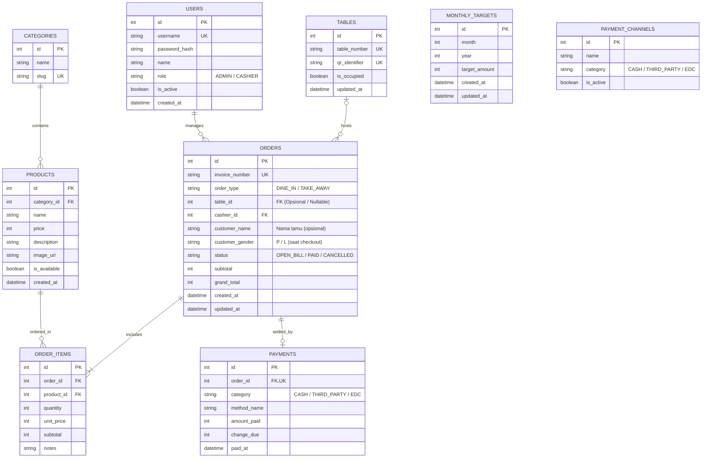

# 5. DATABASE SCHEMA & DATA MODELS (DATABASE.MD)

> **Dokumen Master Utama:** Rincian lengkap 31 bab spesifikasi teknis tersedia di [PRD_MASTER.md](file:///f:/Project/secondacc/docs/PRD_MASTER.md) dan [1_PRD.md](file:///f:/Project/secondacc/docs/1_PRD.md).

---

## 5.1 ERD Overview (Entity Relationship Diagram)



---

## 5.2 Prisma Schema Specification (`schema.prisma`)

Berikut adalah skema resmi yang digunakan oleh **Prisma ORM** dengan database **PostgreSQL**:

```prisma
datasource db {
  provider = "postgresql"
  url      = env("DATABASE_URL")
}

generator client {
  provider = "prisma-client-js"
}

enum Role {
  ADMIN
  CASHIER
}

enum Gender {
  L
  P
}

enum OrderType {
  DINE_IN
  TAKE_AWAY
}

enum OrderStatus {
  OPEN_BILL
  PAID
  CANCELLED
}

enum PaymentCategory {
  CASH
  THIRD_PARTY
  EDC
}

model User {
  id           Int      @id @default(autoincrement())
  username     String   @unique
  passwordHash String   @map("password_hash")
  name         String
  role         Role     @default(CASHIER)
  isActive     Boolean  @default(true) @map("is_active")
  createdAt    DateTime @default(now()) @map("created_at")

  orders Order[]

  @@map("users")
}

model Table {
  id           Int      @id @default(autoincrement())
  tableNumber  String   @unique @map("table_number")
  qrIdentifier String   @unique @default(uuid()) @map("qr_identifier")
  isOccupied   Boolean  @default(false) @map("is_occupied")
  updatedAt    DateTime @updatedAt @map("updated_at")

  orders Order[]

  @@map("tables")
}

model Category {
  id       Int       @id @default(autoincrement())
  name     String
  slug     String    @unique
  products Product[]

  @@map("categories")
}

model Product {
  id            Int      @id @default(autoincrement())
  categoryId    Int      @map("category_id")
  name          String
  price         Int // Integer Rupiah bulat
  description   String?
  imageUrl      String?  @map("image_url")
  isAvailable   Boolean  @default(true) @map("is_available")
  isRecommended Boolean  @default(false) @map("is_recommended")
  isBestSeller  Boolean  @default(false) @map("is_best_seller")
  createdAt     DateTime @default(now()) @map("created_at")

  category   Category    @relation(fields: [categoryId], references: [id])
  orderItems OrderItem[]

  @@map("products")
}

model Order {
  id             Int         @id @default(autoincrement())
  invoiceNumber  String      @unique @map("invoice_number")
  orderType      OrderType   @default(DINE_IN) @map("order_type")
  tableId        Int?        @map("table_id") // Nullable: opsional untuk Take Away atau Dine In walk-in
  cashierId      Int         @map("cashier_id")
  customerName   String?     @map("customer_name")
  customerGender Gender?     @map("customer_gender")
  status         OrderStatus @default(OPEN_BILL)
  subtotal       Int
  grandTotal     Int         @map("grand_total")
  createdAt      DateTime    @default(now()) @map("created_at")
  updatedAt      DateTime    @updatedAt @map("updated_at")

  table      Table?      @relation(fields: [tableId], references: [id])
  cashier    User        @relation(fields: [cashierId], references: [id])
  orderItems OrderItem[]
  payment    Payment?

  @@index([createdAt])
  @@index([status])
  @@index([tableId])
  @@map("orders")
}

model OrderItem {
  id        Int     @id @default(autoincrement())
  orderId   Int     @map("order_id")
  productId Int     @map("product_id")
  quantity  Int
  unitPrice Int     @map("unit_price")
  subtotal  Int
  notes     String? // Catatan kustom teks bebas (e.g. "Less sugar", "Pedas")

  order   Order   @relation(fields: [orderId], references: [id], onDelete: Cascade)
  product Product @relation(fields: [productId], references: [id])

  @@map("order_items")
}

model Payment {
  id          Int             @id @default(autoincrement())
  orderId     Int             @unique @map("order_id")
  category    PaymentCategory
  methodName  String          @map("method_name")
  amountPaid  Int             @map("amount_paid")
  changeDue   Int             @map("change_due")
  paidAt      DateTime        @default(now()) @map("paid_at")

  order Order @relation(fields: [orderId], references: [id])

  @@map("payments")
}

model MonthlyTarget {
  id           Int      @id @default(autoincrement())
  month        Int
  year         Int
  targetAmount BigInt   @map("target_amount")
  createdAt    DateTime @default(now()) @map("created_at")
  updatedAt    DateTime @updatedAt @map("updated_at")

  @@unique([month, year])
  @@map("monthly_targets")
}

model PaymentChannel {
  id       Int             @id @default(autoincrement())
  name     String
  category PaymentCategory
  isActive Boolean         @default(true) @map("is_active")

  @@map("payment_channels")
}
```
