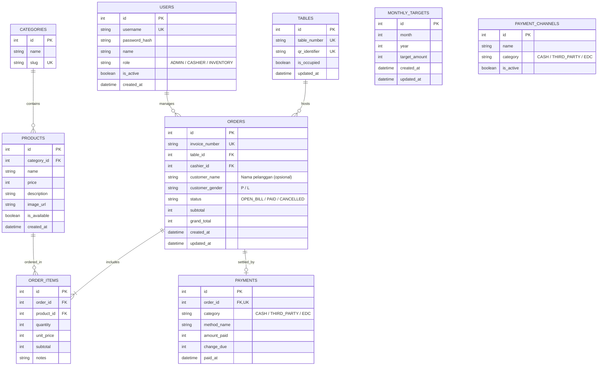

# 5. DATABASE SCHEMA & DATA MODELS (DATABASE.MD)

## 5.1 ERD Overview (Entity Relationship Diagram)



---

## 5.2 Prisma Schema Specification (`schema.prisma`)

Berikut adalah skema resmi yang akan digunakan oleh **Prisma ORM** dengan database **PostgreSQL**:

```prisma
datasource db {
  provider = "postgresql"
  url      = env("DATABASE_URL")
}

generator client {
  provider = "prisma-client-js"
}

enum Role {
  ADMIN
  CASHIER
  INVENTORY
}

enum CustomerGender {
  P // Perempuan
  L // Laki-laki
}

enum OrderStatus {
  OPEN_BILL
  PAID
  CANCELLED
}

enum PaymentCategory {
  CASH
  THIRD_PARTY
  EDC
}

enum PaymentStatus {
  PENDING   // Menunggu pembayaran QRIS Midtrans oleh pelanggan
  SETTLED   // Pembayaran berhasil diverifikasi (Midtrans settlement / Tunai)
  EXPIRED   // Transaksi Midtrans kadaluarsa
  FAILED    // Pembayaran ditolak / gagal
  CANCELLED // Dibatalkan oleh kasir
}

model User {
  id           Int      @id @default(autoincrement())
  username     String   @unique
  passwordHash String
  name         String
  role         Role     @default(CASHIER)
  isActive     Boolean  @default(true)
  createdAt    DateTime @default(now())
  updatedAt    DateTime @updatedAt

  orders       Order[]

  @@map("users")
}

model CafeTable {
  id           Int      @id @default(autoincrement())
  tableNumber  String   @unique
  qrIdentifier String   @unique @default(uuid())
  isOccupied   Boolean  @default(false)
  updatedAt    DateTime @updatedAt

  orders       Order[]

  @@map("cafe_tables")
}

model Category {
  id       Int       @id @default(autoincrement())
  name     String
  slug     String    @unique
  products Product[]

  @@map("categories")
}

model Product {
  id          Int         @id @default(autoincrement())
  categoryId  Int
  category    Category    @relation(fields: [categoryId], references: [id], onDelete: Restrict)
  name        String
  price       BigInt      // Nominal Rupiah aman hingga triliunan
  description String?
  imageUrl    String?
  isAvailable Boolean     @default(true) // Toggle Tersedia / Sold Out
  createdAt   DateTime    @default(now())
  updatedAt   DateTime    @updatedAt

  orderItems  OrderItem[]

  @@map("products")
}

model Order {
  id             Int             @id @default(autoincrement())
  invoiceNumber  String          @unique // Digunakan sebagai order_id di Midtrans
  tableId        Int?
  table          CafeTable?      @relation(fields: [tableId], references: [id], onDelete: SetNull)
  cashierId      Int
  cashier        User            @relation(fields: [cashierId], references: [id])
  customerName   String? // Nama pelanggan (opsional) — ditampilkan di kartu RECENT ORDERS
  customerGender CustomerGender? // Dicatat saat kasir checkout (P / L)
  status         OrderStatus     @default(OPEN_BILL)
  subtotal       BigInt
  grandTotal     BigInt
  createdAt      DateTime        @default(now())
  updatedAt      DateTime        @updatedAt

  items          OrderItem[]
  payment        Payment?

  @@index([createdAt])
  @@index([status])
  @@index([customerGender])
  @@index([tableId])
  @@map("orders")
}

model OrderItem {
  id        Int      @id @default(autoincrement())
  orderId   Int
  order     Order    @relation(fields: [orderId], references: [id], onDelete: Cascade)
  productId Int
  product   Product  @relation(fields: [productId], references: [id])
  quantity  Int
  unitPrice BigInt   // Snapshot harga saat transaksi
  subtotal  BigInt
  notes     String?

  @@map("order_items")
}

model Payment {
  id              Int             @id @default(autoincrement())
  orderId         Int             @unique
  order           Order           @relation(fields: [orderId], references: [id], onDelete: Cascade)
  category        PaymentCategory // CASH, THIRD_PARTY, EDC
  methodName      String          // Contoh: "Midtrans QRIS", "Tunai", "BCA EDC"
  status          PaymentStatus   @default(SETTLED) // Langsung SETTLED untuk kasir manual, PENDING untuk QRIS Midtrans
  
  // Midtrans & Gateway Specific Fields
  gatewayProvider String?         @default("MANUAL") // "MIDTRANS", "MANUAL"
  gatewayRefId    String?         @unique // transaction_id resmi dari Midtrans
  qrString        String?         // String payload untuk render QRIS dinamis di kasir
  paymentUrl      String?         // URL pembayaran / Snap URL jika dibutuhkan
  rawPayload      Json?           // Audit trail payload notifikasi Webhook Midtrans

  amountPaid      BigInt          // Nominal uang yang dibayarkan
  changeDue       BigInt          @default(0) // Uang kembalian (untuk Tunai)
  paidAt          DateTime?       @default(now())
  createdAt       DateTime        @default(now())
  updatedAt       DateTime        @updatedAt

  @@index([status])
  @@index([gatewayRefId])
  @@map("payments")
}

model MonthlyTarget {
  id           Int      @id @default(autoincrement())
  month        Int      // 1 - 12
  year         Int      // Contoh: 2026
  targetAmount BigInt   // Target nominal dalam Rupiah
  createdAt    DateTime @default(now())
  updatedAt    DateTime @updatedAt

  @@unique([month, year])
  @@map("monthly_targets")
}

model PaymentChannel {
  id       Int             @id @default(autoincrement())
  name     String          // Contoh: "QRIS", "Debit BCA", "Tunai Laci"
  category PaymentCategory // CASH, THIRD_PARTY, EDC
  isActive Boolean         @default(true)

  @@map("payment_channels")
}
```
